Input method smoke test

The golden standard is Word

# Table of Contents

 * [[Windows/Mac] Japanese](#windowsmac-japanese)
 * [[Windows] Korean](#windows-korean)
 * [[Windows] Vietnamese with UniKey](#windows-vietnamese-with-unikey)
 * [[Windows] Chinese](#windows-chinese)
 * [[Windows] Sogou pinyin Chinese input method](#windows-sogou-pinyin-chinese-input-method)
 * [[Mac] Zhuyin Input Method (Chinese)](#mac-zhuyin-input-method-chinese)

***

---
## [Windows/Mac] Japanese

* Add the Japanese input method
  * Windows: `Settings > Time & Language > Region & language > Add a language > Japanese`
  * Mac: `Settings > Keyboard > Input Sources > Add a language > Japanese`

* Focus VS Code and switch OS input method to Japanese and choose Hiragana:
  * Windows:  
  * Mac: Choose Hiragana in the menu bar

* Type the following words: `sennsei` or `konnichiha` or `mikann`. Here is how Word looks like doing this:
  * `sennsei` should result in "せんせい" or "先生"
  * `konnichiha` should result in "こんいちは"
  * `mikann` should result in "みかん" or "橘"

  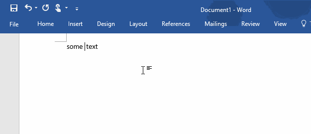

---
## [Windows] Korean

* Add the Korean input method
  * `Settings > Time & Language > Region & language > Add a language > Korean`

* Focus VS Code and switch OS input method to Korean and choose Hangul:

  

* Type `gksrmf` and press space. Here is how Word looks like doing this (it should be "한글"):

  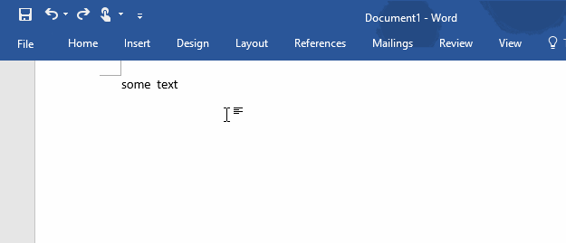

* Type `dkssudgktpdy` in a new file. Here is how Word looks like doing this:

  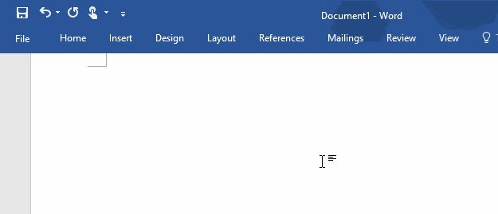

---
## [Windows] Vietnamese with UniKey
* Download and Run [UniKey](http://www.unikey.org/bdownload.php#uk)

* Click the button with a down arrow:

  

* Get the following settings:

  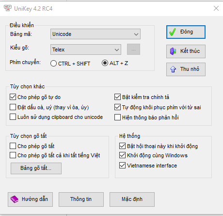

* Focus VS Code and click once UniKey's system tray entry (next to the date) to toggle on Vietnamese mode (get it to be a V):

  

* Type `Tooi` => it should transform to => Tôi. Here is how Word looks like doing this:

  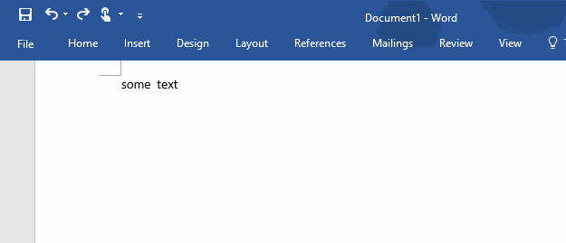

---
## [Windows] Chinese
* Add the Chinese (Simplified) input method
 * `Settings > Time & Language > Region & language > Add a language > Chinese (Simplified)`

* Focus VS Code and switch OS input method to Chinese and choose Chinese mode and make sure the input method's name is Microsoft Pinyin:

  

* Type `.` or `,` in full width form. They should be typed in immediately. Here is how Word looks like doing this:

  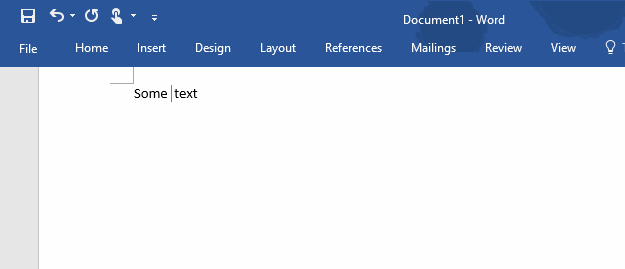

* Type `ni` press `Space` and then `hao` and press `Space`. They should be typed in immediately. Here is how Word looks like doing this:

  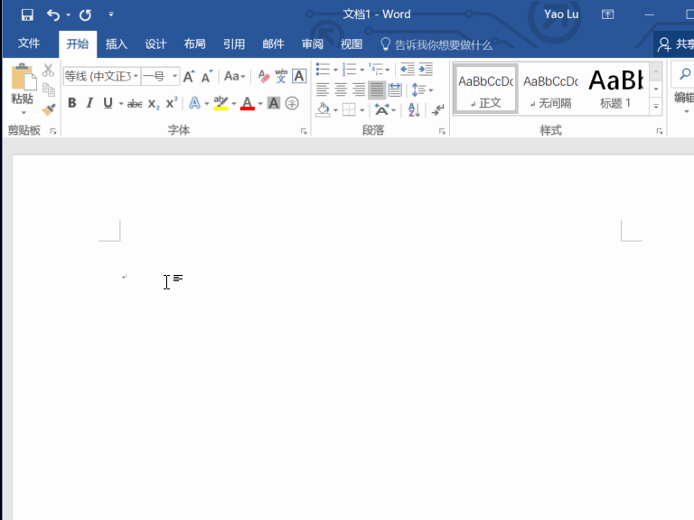

* Type `hazni` press `Space`. It should result into `哈祝你`

--
## [Windows] Sogou pinyin Chinese input method
* Install Sogou pinyin Chinese input method

  * Download Sogou pinyin Chinese input method from [this link](http://pinyin.sogou.com/)

    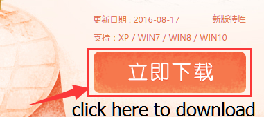

  * Double click downloaded install exe

    

  * Click YES if UAC dialog show  

    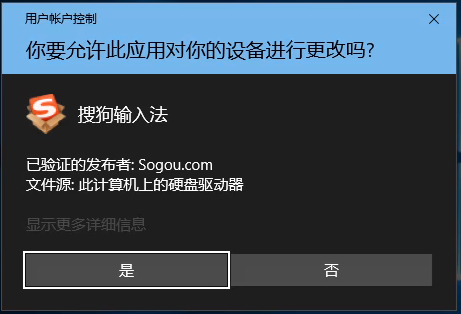

  * Click Install immediately in the install UI

    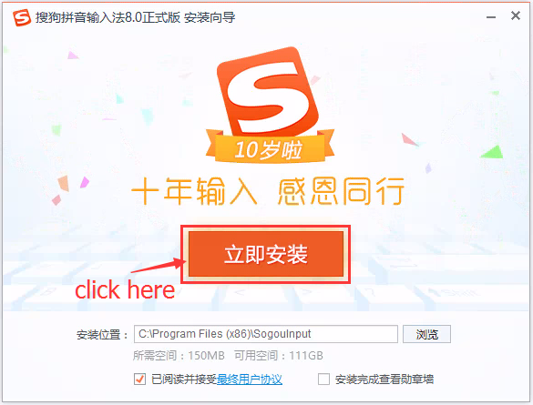

  * Wait for the process complete, UNCHECK the "install the Sogou browser"  

    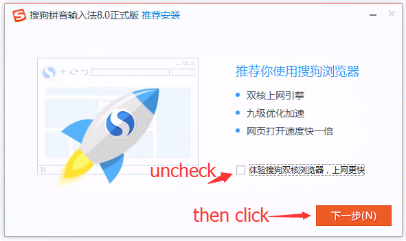

  * Uncheck all options, click finish  

    

* Focus VS Code and switch OS input method to Chinese and choose Chinese mode and make sure the input method's name is Sogou Pinyin:

  

* Type `ni` press `Space` and then `hao` and press `Space`. They should be typed in immediately. Here is how Word looks like doing this: 

  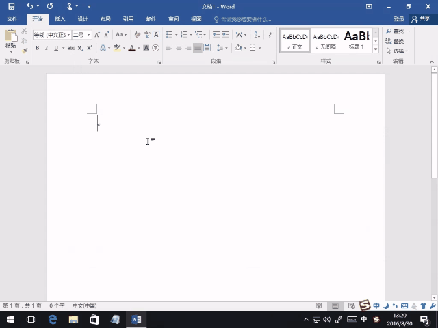

* It should result into `你好`

---
## [Mac] Zhuyin Input Method (Chinese)
* `System Preferences > Keyboard > Input Sources > Add > Chinese, Tranditional > Zhuyin`

  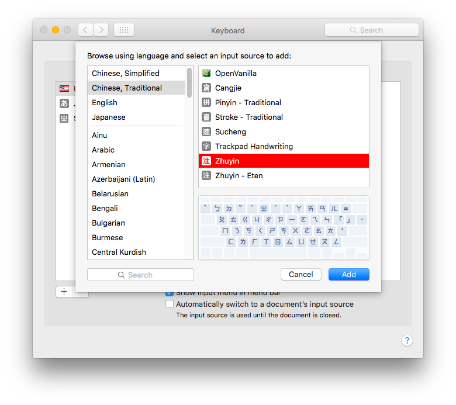

* Focus VS Code and switch OS input method to Zhuyin (press Command + space)

  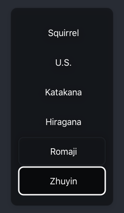

* Type `su3cl3` and press Enter. Here is how World looks like doing this (It should be "你好")

  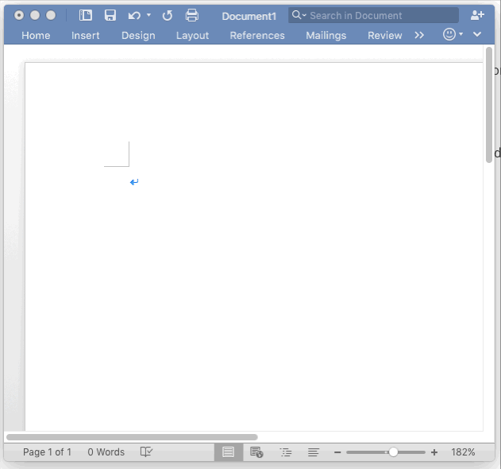

---
## [Mac] The hold input method
* Long press `e`
* A pop-up should appear
* Choose a different variant, like an `e` with an accute accent

---
## [Mac] The emoji inserter

---
## [Linux] Japanese
* Use [mozc](https://wiki.archlinux.org/index.php/Mozc)
* Information for [elementary](http://elementaryos.stackexchange.com/questions/271/how-can-i-enable-japanese-input)

---
Content created from:
* [#1168](https://github.com/Microsoft/vscode/issues/1168)
* [#2250](https://github.com/Microsoft/vscode/issues/2250)
* [#2374](https://github.com/Microsoft/vscode/issues/2374)
* [#5615](https://github.com/Microsoft/vscode/issues/5615)
* [#7997](https://github.com/Microsoft/vscode/issues/7997)
* [#10937](https://github.com/Microsoft/vscode/issues/10937)